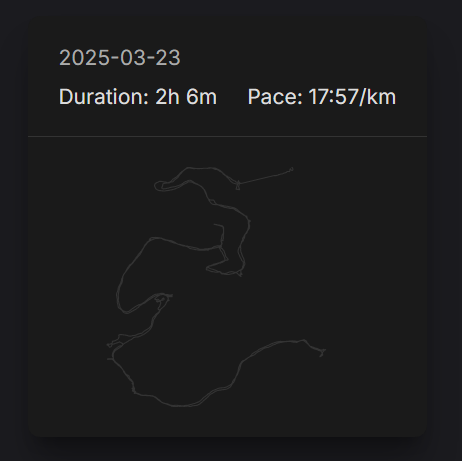

# rollup-plugin-gpx

[![npm version][npm-version-src]][npm-version-href]
[![npm downloads][npm-downloads-src]][npm-downloads-href]
[![bundle][bundle-src]][bundle-href]
[![JSDocs][jsdocs-src]][jsdocs-href]
[![License][license-src]][license-href]

A Vite/Rollup plugin to parse GPX files into GeoJSON format.

## Installation

```bash
pnpm add rollup-plugin-gpx
```

or

```bash
npm install rollup-plugin-gpx
```

or

```bash
yarn add rollup-plugin-gpx
```

## Setup

### With Vite

```js
import { gpxPlugin } from 'rollup-plugin-gpx'

// vite.config.js
import { defineConfig } from 'vite'

export default defineConfig({
  plugins: [
    /// <reference types="rollup-plugin-gpx/gpx" />
    gpxPlugin({
      // options
    })
  ]
})
```

### With Rollup

```js
// rollup.config.js
import gpxPlugin from 'rollup-plugin-gpx'
export default {
  plugins: [
    gpxPlugin({
      // options
    })
  ]
}
```

## Usage

```js
import GpxTravel from './gpx-travel.gpx'

console.log(GpxTravel, 'GpxTravel')
```

sample used in [gweesin's website](https://gweesin.netlify.app/walks/)



## License

[MIT](./LICENSE) License © [gweesin](https://github.com/gweesin)

<!-- Badges -->

[npm-version-src]: https://img.shields.io/npm/v/rollup-plugin-gpx?style=flat&colorA=080f12&colorB=1fa669
[npm-version-href]: https://npmjs.com/package/rollup-plugin-gpx
[npm-downloads-src]: https://img.shields.io/npm/dm/rollup-plugin-gpx?style=flat&colorA=080f12&colorB=1fa669
[npm-downloads-href]: https://npmjs.com/package/rollup-plugin-gpx
[bundle-src]: https://img.shields.io/bundlephobia/minzip/rollup-plugin-gpx?style=flat&colorA=080f12&colorB=1fa669&label=minzip
[bundle-href]: https://bundlephobia.com/result?p=rollup-plugin-gpx
[license-src]: https://img.shields.io/github/license/gweesin/rollup-plugin-gpx.svg?style=flat&colorA=080f12&colorB=1fa669
[license-href]: https://github.com/gweesin/rollup-plugin-gpx/blob/main/LICENSE
[jsdocs-src]: https://img.shields.io/badge/jsdocs-reference-080f12?style=flat&colorA=080f12&colorB=1fa669
[jsdocs-href]: https://www.jsdocs.io/package/rollup-plugin-gpx
